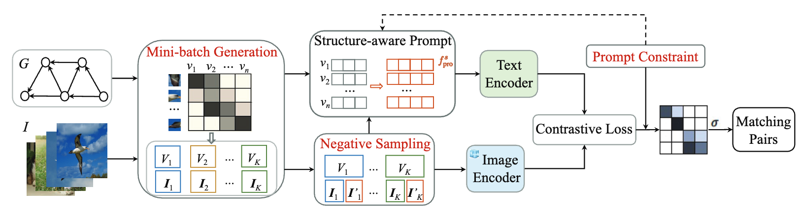

# CrossEM: A Prompt Tuning Framework for Cross-modal Entity Matching

CrossEM is a cross-modal entity matching by prompt-tuning pre-trained multi-modal large models (MMLMs) in an unsupervised manner. The prompt-tuning faces three challenging issues: (i) objective gap between pre-training and tuning of MMLMs; (ii) data modality gap between the inputs of MMLMs and our matching task; (iii) prompt efficiency on large data. Therefore, CrossEM addresses cross-modal EM as a matching probability problem with specific prompt-tuning. Second, two alternative prompt generation methods are designed to extract structural knowledge from heterogeneous data to overcome the data modality gap with pre-trained models. Third, an improved matching framework (namely, CrossEM+) is presented to boost the prompt efficiency on large heterogeneous data

For more technical details, see [CrossEM: A Prompt Tuning Framework for Cross-modal Entity Matching](https://ieeexplore.ieee.org/document/11113143).



## Dependencies and Installion
```
scikit-learn==1.3.2
torch==2.1.0+cu118
torch-cluster==1.6.3+pt21cu118
torch-geometric==2.6.1
torch-scatter==2.1.2+pt21cu118
torch-sparse==0.6.18+pt21cu118
torchaudio==2.1.0+cu118
torchvision==0.16.0+cu118
tqdm==4.67.1
transformers==4.24.0
```

We recommend creating a new conda environment to install the dependencies:
```
conda env remove --name crossem
conda create -y -n crossem python=3.9
conda activate crossem
pip install transformers==4.24.0
```

## Datasets

We use real-world benchmark datasets from [Caltech UCSD Birds 200](https://www.florian-schroff.de/publications/CUB-200.pdf), [SUN Attribute](http://128.148.32.110/people/gmpatter/pub_papers/SUN_Attribute_Database_CVPR2012.pdf) and [FB15K-237-IMG](https://github.com/mniepert/mmkb).
- CUB and SUN are two standard cross-modal semantic grounding benchmarks equipped with attributes, where CUB includes 11,788 images of 200 birds with 312 attributes, SUN has 16,549 images from 717 scene classes with 102 attributes.
- FB15K-237-IMG consists of a subset of the large-scale knowledge graph Freebase and a set of images where each entity is associated with 10 images.

## Quick Start

To train and evaluate with CrossETR.

```
python main_paral.py [<args>] [-h | --help]
```

- task parameters:
    datam, image, kg, train_class_loc, test_unseen_loc, test_seen_loc
- graph training parameters:
    num_epochs, batch_size, lr, g_type, hidden_channels(256), out_channels(128), agg_fun
- prompt parameters: 
    p_mode, p_metric, backbone, n_ctx, ctx_init, ctx_bais, clss, p_batch_size, tk_w, p_lr, p_epochs, p_clusters, tops, c_prune, pcp, hns', oloss, scala
- optimization parameters: 
    block_rate, blocker, cluster_num, bl, fusion, combine, new_trip, sample_num

## Download the models
We use bert-base-uncased as the pretrained language model in all experiments.

You can download the pre-trained checkpoint from [Google-BERT](https://huggingface.co/google-bert/bert-base-uncased) manually.


## Citation
If you find our work useful, please kindly cite the following paper:

```
@inproceedings{DBLP:conf/icde/YuanYWCW25,
  author       = {Qin Yuan and
                  Ye Yuan and
                  Zhenyu Wen and
                  Chi Chen and
                  Guoren Wang},
  title        = {CrossEM: {A} Prompt Tuning Framework for Cross-Modal Entity Matching},
  booktitle    = {41st {IEEE} International Conference on Data Engineering, {ICDE} 2025,
                  Hong Kong, May 19-23, 2025},
  pages        = {627--640},
  publisher    = {{IEEE}},
  year         = {2025},
  doi          = {10.1109/ICDE65448.2025.00053}
}
```